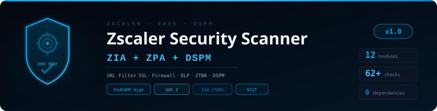

<p align="center">
  
</p>
<p align="center"><strong>A Python-based security scanner for Zscaler ZIA, ZPA, and DSPM</strong></p>
<p align="center">
  
  
  
  
  
  
  
</p>

---

## Overview

Analyzes Zscaler ZIA, ZPA, and DSPM configuration exports (JSON) against Zscaler Recommended Baseline Policies, Leading Practices, and zero trust security principles. **59+ checks across 12 modules**, zero external dependencies.

## Audit Modules (12)

| # | Module | Key | Checks | Coverage |
|---|--------|-----|--------|----------|
| 1 | 🌐 **URL Filtering** | `zia-url` | 6 | High-risk categories, uncategorized URLs, caution pages, safe search, default action |
| 2 | 🔓 **SSL Inspection** | `zia-ssl` | 5 | SSL enabled, bypass rules, cert pinning, TLS minimum, Client Connector SSL |
| 3 | 🔥 **Cloud Firewall** | `zia-fw` | 5 | Firewall rules, default deny, DNS rules, logging, rule hygiene |
| 4 | 🛡️ **Threat Prevention** | `zia-threat` | 4 | Cloud Sandbox, ATP/IPS, browser control, file type control |
| 5 | 📊 **DLP & Data Protection** | `zia-dlp` | 5 | DLP policy, dictionaries (SSN/CC/PII/HIPAA/PCI/GDPR), EDM, enforcement mode, ICAP |
| 6 | ☁️ **Cloud App Control** | `zia-app` | 4 | App control policy, risky apps (BitTorrent/Tor/VPN), shadow IT discovery, tenant restrictions |
| 7 | 🔑 **ZPA Access Policy** | `zpa-policy` | 6 | Access rules, least privilege, device posture, user risk score, default deny, re-auth timeout |
| 8 | 🏗️ **ZPA Application Security** | `zpa-app` | 5 | Wildcard segments, connector health, segment isolation, bypass settings, server group mapping |
| 9 | 👤 **Admin Security** | `admin` | 5 | Dormant admins, super admin sprawl, admin MFA, IP restrictions, API key rotation |
| 10 | 🔐 **Authentication & IdP** | `auth` | 4 | IdP config, SCIM provisioning, SAML settings, surrogate IP timeout |
| 11 | 📦 **DSPM Controls** | `dspm` | 5 | DSPM enabled, data classification, exposure monitoring, enforcement policies, data-at-rest scanning |
| 12 | 📋 **Audit & Compliance** | `audit` | 5 | Audit logging, NSS/SIEM integration, log retention, location auth, forwarding bypass |

## Quick Start

```bash
git clone https://github.com/Krishcalin/Zscaler-Security-Scanner.git
cd Zscaler-Security-Scanner
python zscaler_scanner.py --data-dir ./sample_data --output report.html
python zscaler_scanner.py --data-dir ./exports --modules zia-url zia-ssl zpa-policy dspm
python zscaler_scanner.py --data-dir ./exports --severity HIGH
```

### Exporting Zscaler Configurations
Export JSON configs via Zscaler Admin Portal or API:
- **ZIA**: Policy > URL Filtering / SSL Inspection / Firewall / DLP / Cloud App Control
- **ZPA**: Applications > App Segments / Access Policy / Connectors
- **Admin**: Administration > Admin Users / Auth Settings / Audit Logs
- **API**: Use Zscaler API or `zscaler-terraformer` for bulk export

## Project Structure
```
Zscaler-Security-Scanner/
├── zscaler_scanner.py              # Main entry point
├── modules/
│   ├── base.py                     # Data loader & base auditor
│   ├── zia_security.py            # URL Filtering, SSL, Firewall, Threat
│   ├── zia_zpa_modules.py         # DLP, App Control, ZPA Policy, ZPA Apps
│   ├── platform_dspm.py           # Admin, Auth/IdP, DSPM, Audit
│   └── report_generator.py        # HTML dashboard
├── sample_data/                    # 23 demo config files
├── docs/banner.svg
├── .gitignore, LICENSE, CONTRIBUTING.md, README.md
```

## References
- [Zscaler Recommended Baseline Policies](https://help.zscaler.com/zscaler-deployments-operations/zia-policy-leading-practices-guide)
- [Zscaler SSL Inspection Leading Practices](https://help.zscaler.com/zscaler-deployments-operations/zia-ssl-inspection-leading-practices-guide)
- [Zscaler Security Analytics Best Practices](https://www.zscaler.com/resources/white-papers/zscaler-security-analytics.pdf)
- [ZPA Zero Trust Segmentation Reference Architecture](https://www.zscaler.com/resources/reference-architectures/zero-trust-user-to-app-segmentation-zpa.pdf)
- [ZPA Adaptive Access Policy](https://www.zscaler.com/blogs/product-insights/real-time-risk-mitigation-zpa-adaptive-access-policy)
- [Zscaler User Provisioning & Authentication](https://www.zscaler.com/resources/reference-architectures/user-provisioning-authentication-zscaler-services.pdf)

## License
MIT License
